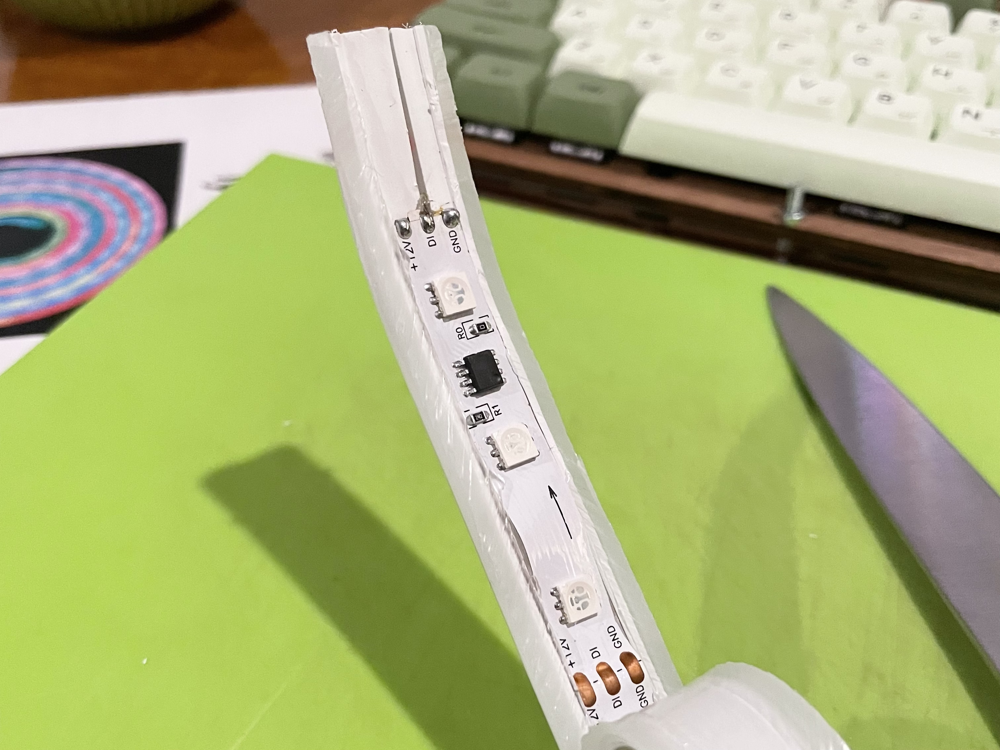
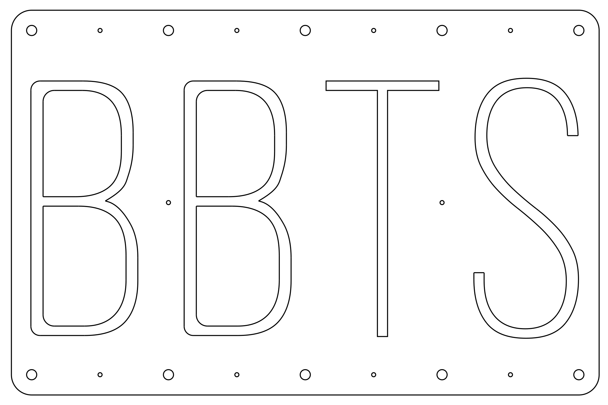
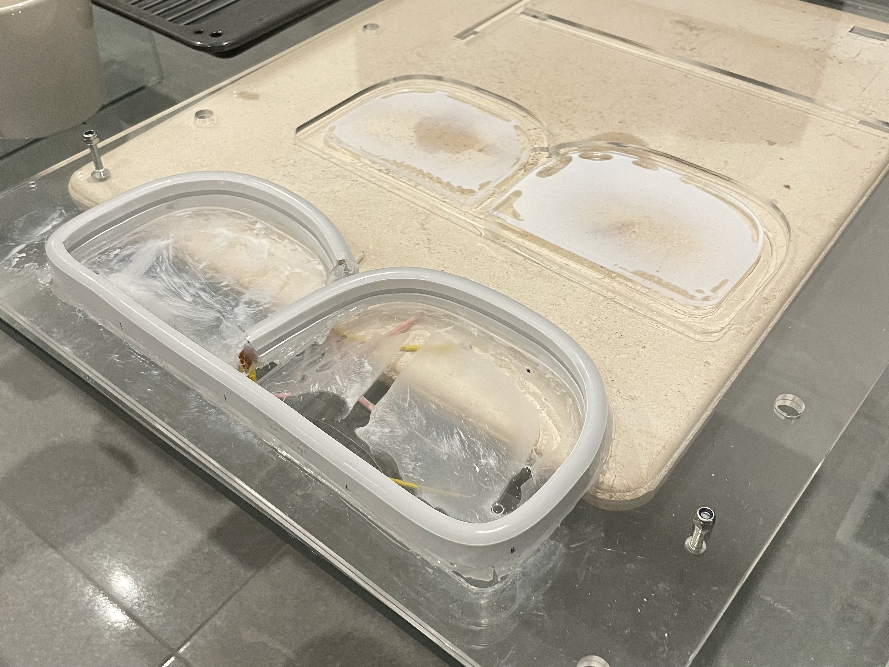
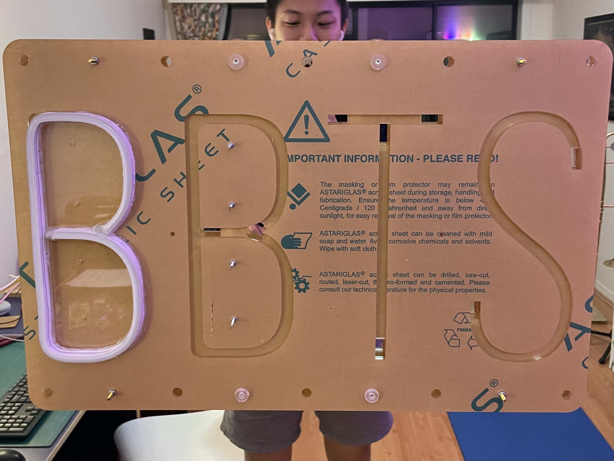
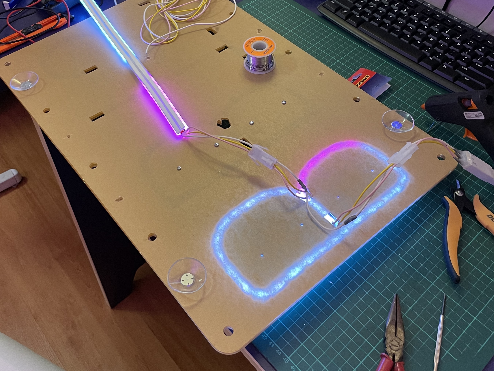
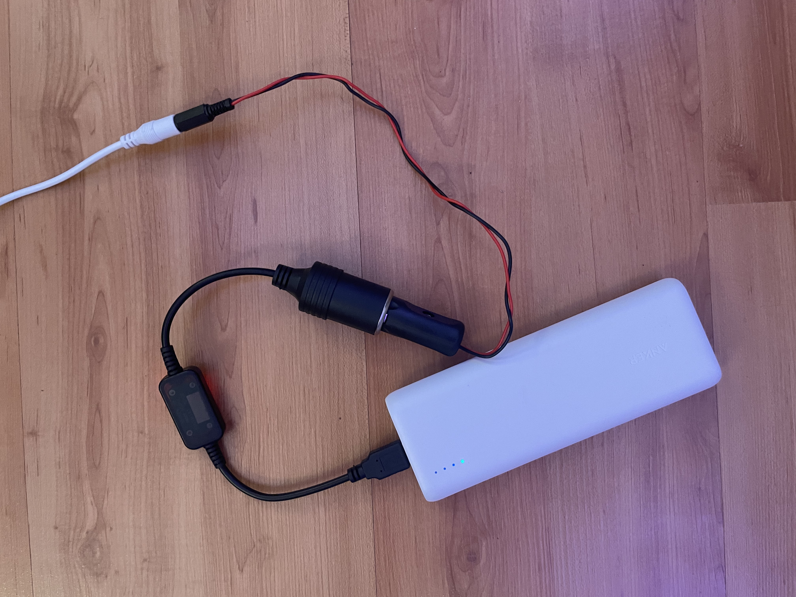
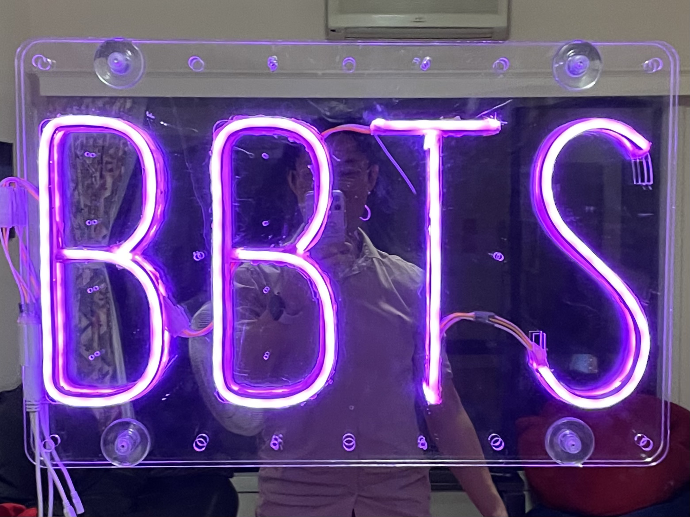

New uni clubs are tend to be strapped for cash and the QUT Bubble Tea Society was no different. Co-founding the club this year gave me the unexpected cool opportunity to save money by putting my DIY skills to use.

The motivation for this project was to provide a unique backdrop for our photo walls at the BBTS Ball in September. Most "neon" signs nowadays are actually made from LEDs, which are much cheaper and more power efficient than actual neon tubes. Stil, custom LED-based neon signs run for many hundreds of dollars--I thought I could do it cheaper and better myself.

I'm super happy with the final result and can't wait to show it off at the ball in a few weeks' time!

## Technical details and process

The final product uses the $55 [Lytworx 5m Rainbow Neonflex](https://www.bunnings.com.au/lytworx-5m-rainbow-neonflex-light_p0200719) from Bunnings. I chose this one because it contained addressable RGB LEDs that could be configured to play different patterns from a remote. Cutting it up and doing some measurements revealed that it contained 48 LEDs per metre in groups of 3, each group controlled by its own IC:

With LED strip dimensions at hand, I designed a two-layer acrylic mounting board with troughs to guide placement. I used a combination of Illustrator and Fusion 360 here. The drawing below shows the top plate, with holes for mounting and attaching suction cups.

In the first attempt, three types of glue were used to disastrous effect. The super glue's fumes left corrosion marks on the plastic. The PVA glue didn't set. The hot glue worked, but insane amounts were required to make things stay in place and care had to be taken not to cover the board with stringy bits.

After some slight modifications, the second attempt was assembled exclusively with hot glue and much more care was taken to reduce marks on the plastic. Keeping the paper film on the plastic while gluing helped a lot.

Initially, I added three-pin JST connectors at the ends of each strip to provide some modularity and repairability. You can see these connectors in the image below. I eventually abandoned this because they added bulk and another point of weakness. 

The solder points on the LED strip are very fragile and these caused me an enormous amount of trouble. The image below also shows the strip's extremely bizarre behavour when the ground wire becomes detached. The weakness at the connection points was solved in much the same way as this project's other issues: by drowning them in hot glue.

Lastly, I made a modified power source so it can run off a battery. The LED strip accepts 12 V DC through a 5 mm DC barrel jack. I replaced the included wall wart AC adaptor with a USB-to-cigarette lighter step-up converter that I found on eBay. This was then chained to a cigarette lighter-to-DC barrel jack cable I made myself. Not the most elegant solution, but it gives me the option of using a USB power bank or a car as a power source. After 5 hours of use, it hardly made a dent in my 20000 mAh power bank.

Here's another photo of the finished product, this time in the more classic solid pink mode that we'll probably use at the ball:

## Reflections
Making this sign myself has made me appreciate the high price tags of commercial custom neon signs, and it's also made me hyper-aware of how pervasive these signs are. The walls at fancy cafes, bubble tea shops, trendy restaurants and tourist attractions are plastered with these in the eternal battle for attention on Instagram. But despite the size of the industry, there isn't much good quality documentation out there showing how to work with the neon flex strips.

These are some changes I'd make if I ever did this again:
* *Use a higher-quality LED strip.* I discovered why the Bunnings LED strip was so cheap: it's relatively dim, quite fragile, and the LEDs are very sparsely distributed. Don't cheap out on the LED strip.
* *Use a different mounting method.* Hot glue is messy and not very strong. Many neon signs I've seen in the wild use transparent plastic clips that screw onto a backing board to hold the strip in place. This would make the assembly process much cleaner and easier, and the final product more repairable.
* *Cut a tighter margin around the LEDs.* The big rectangular acrylic border is pretty ugly and attracts dust and fingerprints. I didn't realise this until too late, but most LED neon signs cut the acrylic to follow the shape of the sign itself, which looks much more natural.
* *Don't bother with addressable LEDs.* The effects that addressable LEDs can produce are very, very cool but it adds much more complexity. Addressable LEDs need all LEDs to be connected in series for the data line to work, which means one failed connection can take out a huge chunk of the strip. They also require a separate controller and remote. If I could get away with a single colour sign in the future, I probably would take that option.

