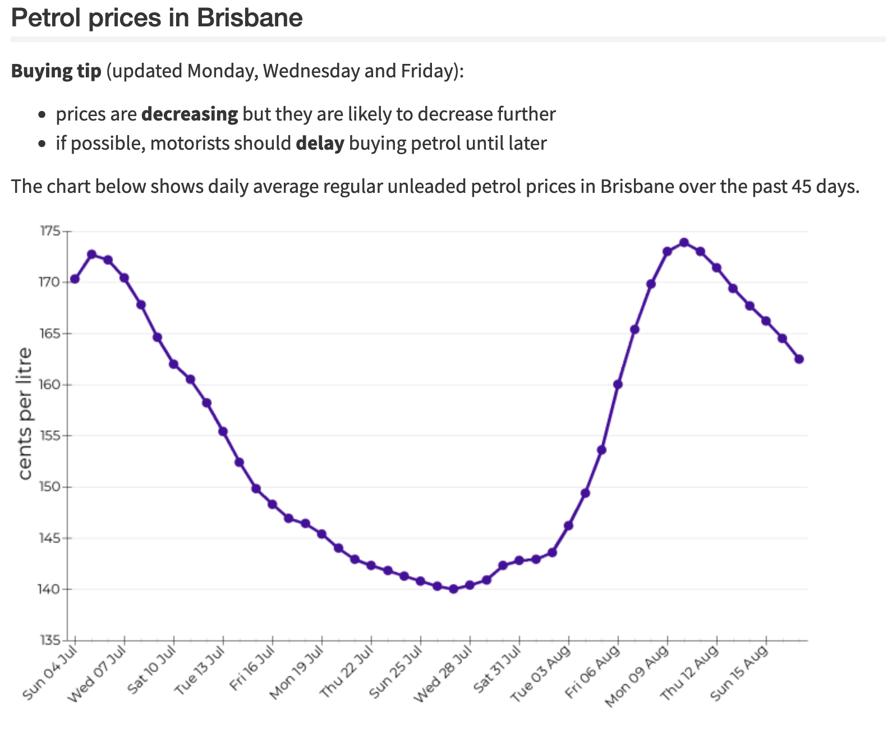

I used to check the [ACCC petrol price cycle web page](https://www.accc.gov.au/consumers/petrol-diesel-lpg/petrol-price-cycles) almost daily as a poor uni student. The moment it seemed like prices were rising, I would rush to the nearest discount petrol station, determined to fit every drop of bargain fuel I could into my petrol tank to tide me over for the next month while prices creeped down.

The web page shows a graph of current average petrol cycles along with a text-based "buying tip" indicating if prices are *increasing*, *decreasing*, at the *highest point* in the cycle, or the *lowest point* in the cycle:

Surely the painless 10-second process of checking this page could be automated, right? 

I used [Google Apps Script](https://script.google.com), Google's JavaScript-powered cloud automation tool, to periodically crawl the ACCC price cycle web page and send me an email if the cycle status has changed to "increasing" or "decreasing". I also embedded the fuel price graph in the email. See the cover image for a screenshot.

This script has saved me hundreds of dollars over the years. Even my parents have asked me very nicely to be added to the mailing list :)

Source code is available on [GitHub](https://github.com/jarodlam/petrol-price-cycle-notification).

## Technical details
Google Apps Script gives the ability to schedule a JavaScript function that runs on Google's servers at a specified time interval. I've set my function to run once an hour.

We start by loading the ACCC page and storing the raw HTML source:

var text = UrlFetchApp.fetch("https://www.accc.gov.au/consumers/petrol-diesel-lpg/petrol-price-cycles").getContentText();


Then, a regular expression is used to to extract the Brisbane section of the page:

var regExp = new RegExp(/(Petrol prices in Brisbane<\/h2>)([\S\s]*?)(<\/ul>)/);
var matchedText = regExp.exec(text);


The matched text is searched for the string `"increasing"`. We assume that if prices are not increasing, they are decreasing. I only really want to be notified when prices begin to increase so I can buy petrol just before they shoot up. 

var isIncreasing = matchedText[0].includes("increasing");


I also only want to be notified when the state changes, not every time the script runs. We therefore need to be able to check the state from the previous run. To do this, I use Google Apps Script's `PropertiesService` class, which can store persistent key-value pairs. A property called `isIncreasing` is set to `"increasing"` or `"decreasing"` depending on the current state. The current state is compared to the previous state and terminates execution if they have not changed.


var properties = PropertiesService.getScriptProperties();
var prevIsIncreasing = properties.getProperty("prevIsIncreasing");
properties.setProperty("prevIsIncreasing", isIncreasing);
if (isIncreasing.toString() == prevIsIncreasing) {
  Logger.log("Current status is the same as previous status (" + (isIncreasing ? "increasing" : "decreasing") + "). Terminating with no notification.");
  return;
}


Finally, an email is sent if the state has changed. The Google Apps Script `MailApp` class provides an interface to send email directly from the currently logged in Gmail account.


MailApp.sendEmail({
  bcc: "jlam96@gmail.com,lamc67@gmail.com,winnie.lam6@gmail.com,seohyun9702@gmail.com",
  //bcc: "jlam96@gmail.com",
  subject: "Petrol prices " + (isIncreasing ? "INCREASING!" : "decreasing"),
  htmlBody: "\
<!doctype html><html><body>\

This is an automated email.
\

Brisbane petrol prices are now <b>" + (isIncreasing ? "INCREASING" : "DECREASING") + "</b>. \
More information <a href='https://www.accc.gov.au/consumers/petrol-diesel-lpg/petrol-price-cycles#petrol-prices-in-brisbane'>here</a>.
\
\
</body></html>"
});
