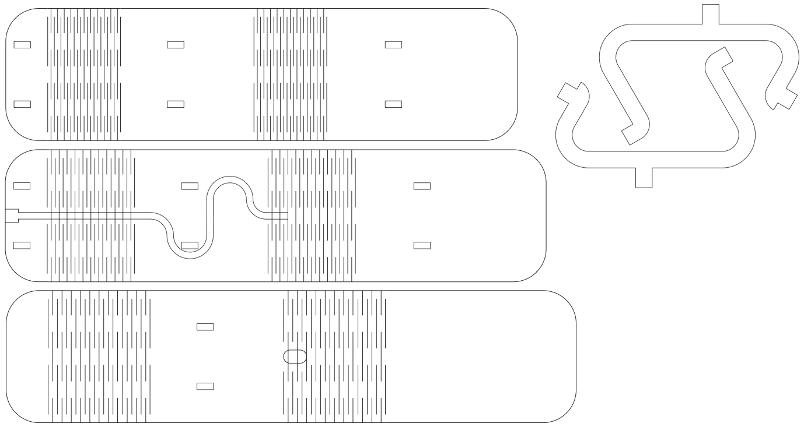
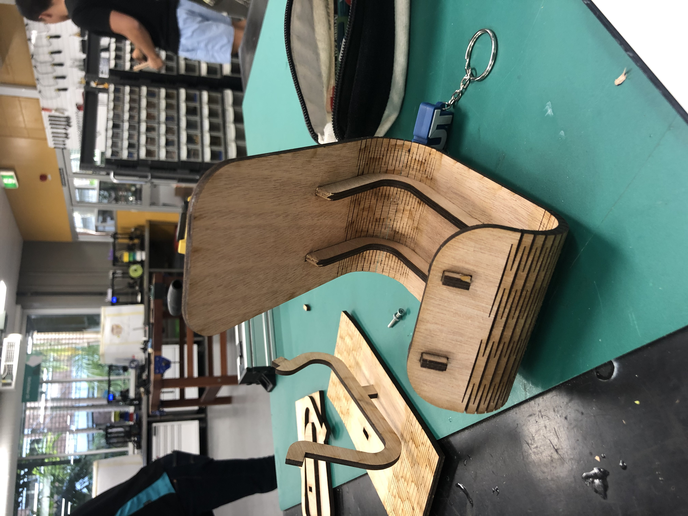
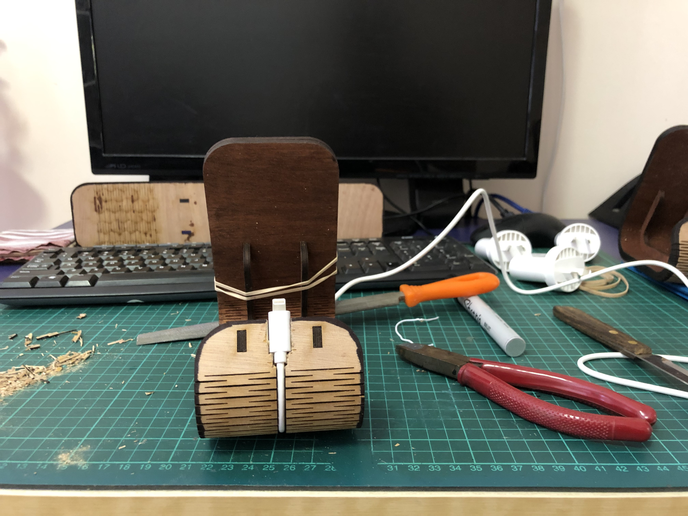
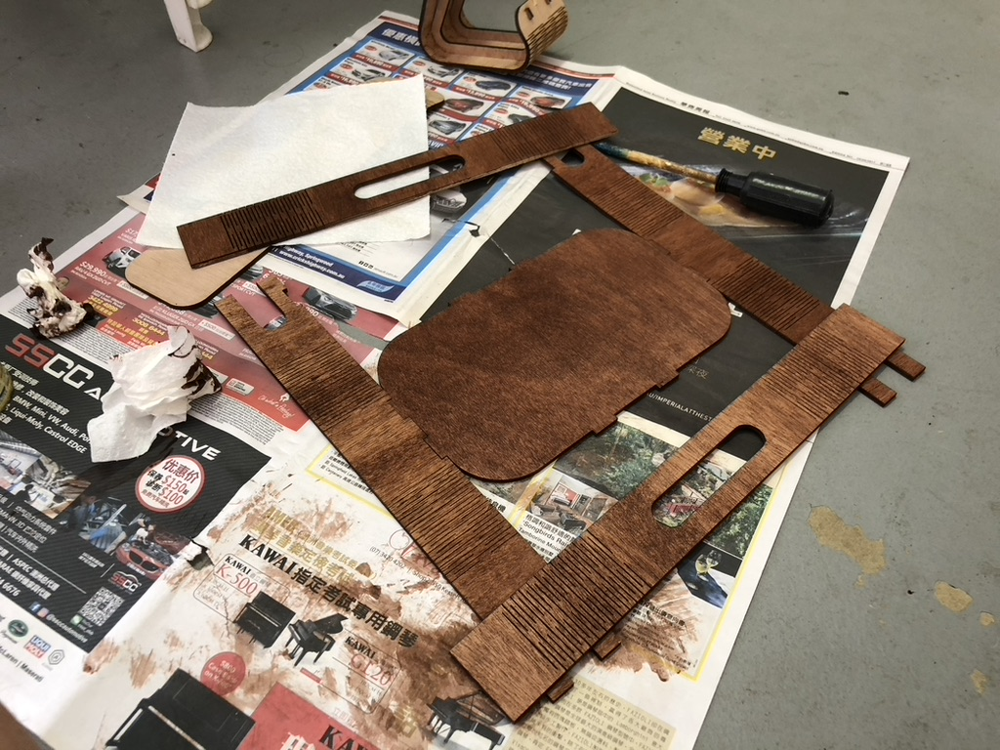
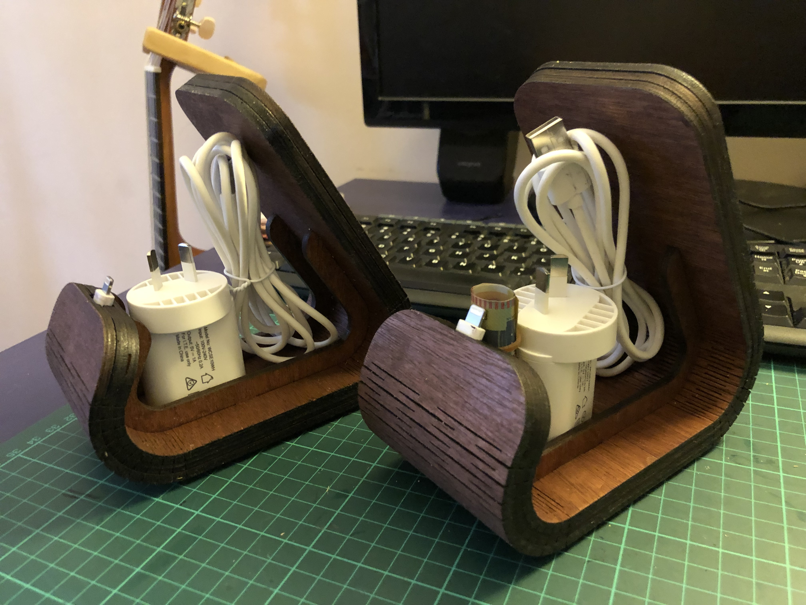

I made a few of these back in December 2019 as Christmas presents for my family. I love the look of laser kerf bent plywood and I think they turned out really nice!

It is made of three 4mm plywood layers. The middle layer contains a cutout for a phone charging cable with a bend to reduce cable strain. Two inner pieces support the outer structure. The laser cutting file looks like this:

Layer 1 was cut out first to make sure that the bend radius was correct. I use a base pattern that I found empirically, then repeat the pattern to increase the turn angle, and scale the pattern to change the bend radius.

Layer 2 contains the cable. I had to chisel it out a bit wider to fit the Lightning cable I bought online. The cable is glued in-place.

The pieces were stained with a dark wood stain and varnished. I need a couple of coats to get the right colour.

Once they were dry, the pieces were assembled and glued together.

## Reflections
These phone stands were really well-received!

However, its lack of repairability and upgradeability became a problem over time. One of the cables stopped working. Another person switched to an Android phone. 

I have two ideas for a redesign:
* **Screw assembly:** I avoided using screws to preserve seamless outer finish. If I were to add screws, I'd try to use counter-sunk screws and threaded inserts to keep a flush surface. 
* **Wireless charging:** I'd like to repurpose this design as a wireless charging stand, either by embedding some wireless charging hardware or attaching an iPhone MagSafe stand.
